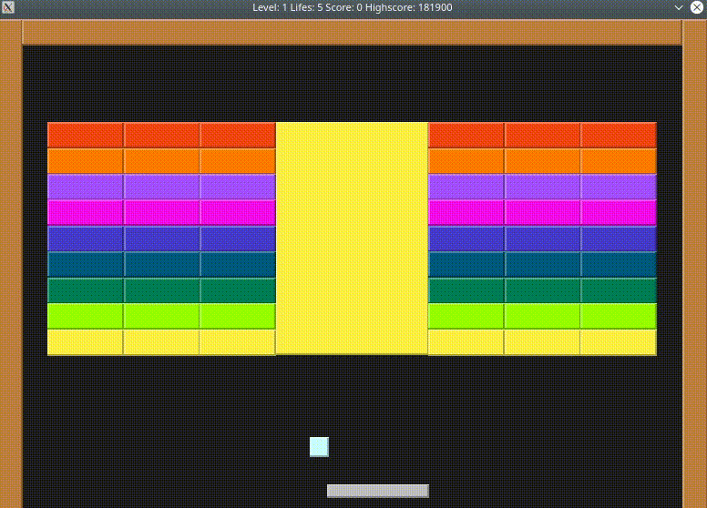
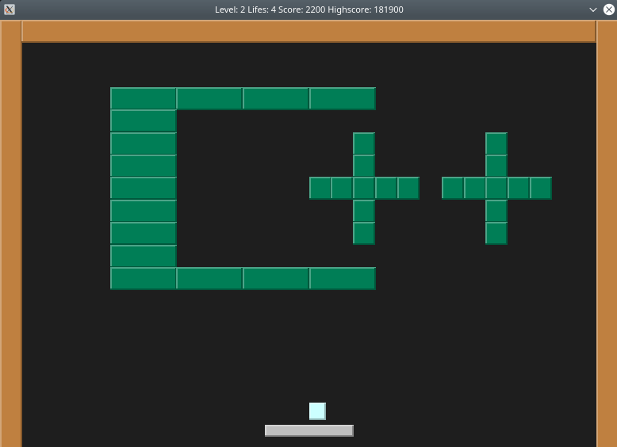
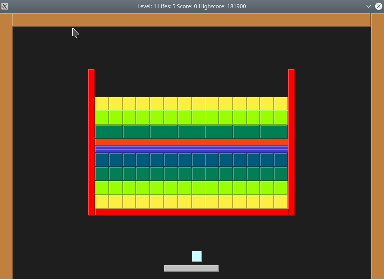

# Bricks



<table>
  <tr>
    <td></td>
    <td></td>
  </tr>
    <tr>
    <td></td>
    <td></td>
  </tr>
 </table>

## C++ Version

* This game is based on the C++ Version I developed before. You can find it [here](https://github.com/SandroWissmann/Bricks)

## Features

* Basic gameplay similar to games like [Breakout](https://en.wikipedia.org/wiki/Arkanoid) or [Arkanoid](https://en.wikipedia.org/wiki/Arkanoid)
* It displays Level, Lifes, Score and Highscore
* Sound
* It contains 5 Levels to play (but more can be added, since they are loaded from files)
* The difficullty increases on each playthrough
* The "Highscore" is saved on program exit
* It contains a "Pause" function (Press P)


## Dependencies for Running Locally
I strongly recommend to install into a virtual environment.

* Linux:
  * Python 3.8.5 (A slightly older version like 3.6 should be fine aswell)
  * Install virtualenv: `pip3 install virtualenv`
  * Create virtual environment: `virtualenv .venv`
  * Activate virtual environment: `source .venv/bin/activate`
  * Install missing packages:
    * numpy: `pip3 install numpy`
    * pygame: `pip3 install pygame`
  * Install module bricks:
    * `cd src` 
    * `pip install -e .`
    * `cd ..`

If you want to run the unit tests you have to install pytest aswell with:
* `pip3 install pytest`

See also the [requirments.txt](https://github.com/SandroWissmann/Bricks-Py/blob/master/requirements.txt) for a list of installed packages

### Running the game

1. In root folder activate virtualenv with: `Source .venv/bin activate`
2. Run game: `python3 src/bricks/app.py`

### Running the tests

1. In the root folder run: `python -m pytest`

## How to add your own Levels:

1. Go to folder `level`
2. Add a new file with the ending `.json`

Levels get loaded in sorted order.

### Format of the file

```JSON
{
    "width": 26,
    "height": 18,
    "bricks": [
        {
            "top_left_x": 6.0,
            "top_left_y": 5.0,
            "width": 1.0,
            "height": 1.0,
            "hitpoints": 1
        },
        {
            "top_left_x": 7.0,
            "top_left_y": 5.0,
            "width": 1.0,
            "height": 1.0,
            "hitpoints": 1
        },
    ],
    "indestructible bricks": [
        {
            "top_left_x": 5.5,
            "top_left_y": 3.0,
            "width": 0.5,
            "height": 10.5
        },
        {
            "top_left_x": 20.0,
            "top_left_y": 3.0,
            "width": 0.5,
            "height": 10.5
        },
    ]
}
```

#### Width / Height:

```
    "width": 26,
    "height": 18,
```

It defines the size of the board. All sizes from all levels should be the same.
If you want different sizes, you have to change it in all the `.lvl` files.

#### Bricks:

```JSON
    "bricks": [
        {
            "top_left_x": 6.0,
            "top_left_y": 5.0,
            "width": 1.0,
            "height": 1.0,
            "hitpoints": 1
        },
        {
            "top_left_x": 7.0,
            "top_left_y": 5.0,
            "width": 1.0,
            "height": 1.0,
            "hitpoints": 1
        },
    ],
```

* top_left_x = X Position on the grid 
* top_left_y = Y Position on the grid
* width = Width of the brick
* height = Height of the brick
* hitpoints = Hitpoints of the brick. Must be in range 1 to 9.

#### Indestructible Bricks:

```JSON
    "indestructible bricks": [
        {
            "top_left_x": 5.5,
            "top_left_y": 3.0,
            "width": 0.5,
            "height": 10.5
        },
        {
            "top_left_x": 20.0,
            "top_left_y": 3.0,
            "width": 0.5,
            "height": 10.5
        },
    ]
  ```

Same as Bricks. The only difference is the missing `hitpoints` specification.

## License

This project is licensed under the MIT License - see the [LICENSE.md](LICENSE.md) file for details